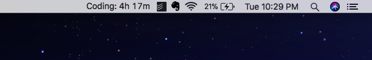

# wakatime-tracker
MacOS menu bar app that shows how many hours you've coded today (tracked using Wakatime).



## Setup

This guide assumes that you're already a Wakatime user.  

  
1. Install [BitBar](https://getbitbar.com/)
  
2. Clone this repo
  
3. Generate your Api key & Api Secret from Wakatime.  
You can get your API key from the [your Wakatime settings page](https://wakatime.com/settings/account)  
You can find your userID by checking out the `id` field that you see when you visit [this API](https://wakatime.com/api/v1/users/current). It'll look something like this: `440f59f1-fed1-43bb-ae4f-3c117c2a653c`  

3. Rename `secrets.example.json` to `secrets.json` and enter your API key & userID in that file.  
  
4. Install dependencies & build
```
npm install
npm run build
```
  
A new folder named `dist/` would now appear. Inside `dist/` you'll find `wakatime.5m.sh`  
  
  
5. Change permissions of `wakatime.5m.sh` to make it executable
```
chmod +x wakatime.5m.sh
```  
  
  
6. Drop wakatime.5m.sh in your BitBar plugins folder.  
If you don't already have one, create a new folder anywhere and drop the script there.  
Once you've launched BitBar, you can set this new folder as the plugins folder by selecting the `Change Plugins Folder`   
  
  
  
7. Start BitBar using finder.
  
Done!
  
